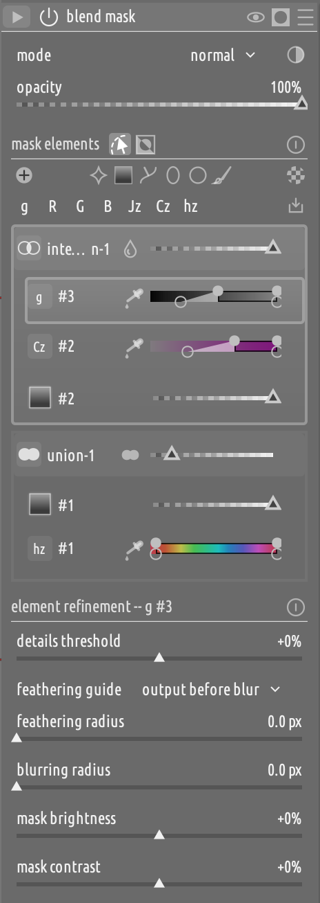

# Flexi mask

**Do more with masks, all from one place.**

Flexi is an experimental mask panel that simplifies the mental model behind masking
while making it more powerful, and adds a set of workflow improvements on top. It
subsumes what the combination of drawn+parametric masks and the mask manager
currently provide, making the latter de-facto redundant, and expresses combinations
the classic model cannot.

  

## TL;DR

### The model

- **Shapes, single parametric channels, and raster masks are all first-class
  elements** of a shared vocabulary: each just contributes a 0–1 value at every
  pixel, combined by the same explicit operators — no more per-type combination
  logic (add/subtract for shapes, always-AND for parametric channels, exclusive
  replacement for raster).
- **Elements belong to groups; groups belong to the mask.** A group has two
  operators: how its own elements combine, and how the group composites onto what
  came before. This makes `(A ∪ B) ∩ C` an explicit structure instead of something
  reverse-engineered from list order.
- **A group also carries its own opacity, refinement, invert, name, and a bypass
  switch** — properties no classic shape or parametric config had anywhere to
  attach to.
- **Two new operators**, "screen" (soft union) and "multiply", alongside
  union/intersect/difference/sum/exclusion.
- **Multiple instances of anything**: several raster sources, or the same
  parametric channel with different curves used more than once, each independently
  combined — not one exclusive slot per mask.
- **Fully backward compatible**: existing edits, if migrated to Flexi, render exactly as before.

### The UX

NOTE: the panel itself is an early prototype, though already fairly polished.

- **A new masks panel** (Flexi) that can fully replace the classic mask
  machinery — every classic mask mode plus the mask manager — with one
  panel, for a more polished, modern, and streamlined UX.
- **Add groups** above/below existing ones, and **add elements** (shapes,
  parametric channels, raster masks) directly into the selected group.
- **Persistent group selection** for quick mask building: select a "subtract"
  group, then keep adding brush strokes that land there automatically.
- **Everything lives in one panel.** Changing a shape's operator or reordering
  elements used to mean jumping to the mask manager, often clear across the
  screen from the module; in Flexi it's right there, next to the shape itself.
- **Per-element controls** (channel selection, opacity, feather, size, hardness...)
  live right in the row.
- Group or element **solo**, to isolate it temporarily.
- Per-shape **solo-edit**: narrows canvas editing to one shape's nodes/handles
  without hiding the rest of the mask.
- **Drag-and-drop** reordering/merging, inline add/rename, **automatic clustering**
  of long same-kind shape runs, and **two-way canvas↔list** hover/selection sync.
- **Group layout presets**, reusable across all masks of all modules; two ship by
  default ("basic", and "add + subtract + intersect").
- **Choice of panel position** — embedded in each module, docked in the utility
  area, or its own separate panel on the left or right to better fit your preferred workflow.

## 1. The model: what's newly expressible

Classic masking is one flat list, folded left to right, and it forces three
different mental models depending on what you're combining: a drawn shape is a
region with add/subtract polarity and list-order semantics; a parametric mask is
one multi-channel config where every enabled channel is always AND'd together
internally; a raster mask isn't combined with anything — it exclusively replaces
whatever else was there, one source per module.

Flexi replaces all three with one: every element — a shape, a single parametric
channel, a raster reference — produces a 0–1 value, and every group combines its
members with the same operator vocabulary (union, intersect, difference, sum,
exclusion, multiply, screen). What kind of element it is only changes how its own
value gets computed, never how it combines with the rest.

What this newly makes possible:

- **Real structure, not a chain.** `(brush A ∪ brush B) ∩ parametric-red` is an
  explicit group boundary, not something inferred from list order. Reordering
  elements inside a group no longer changes the mask's meaning.
- **Single-channel parametric elements, reusable and combinable.** Pin a
  parametric element to exactly one channel and use it as an ordinary group
  member — including more than once, with different curves, combined by whatever
  operator you choose instead of a fixed AND.
- **Multiple raster sources in one mask**, each its own group member, instead of
  one exclusive reference per module.
- **Group-level opacity, refinement, and invert** — properties of the *composed*
  result, on top of (not instead of) each element's own. Classic had no group to
  attach these to.
- **Bypass**, to drop a group's contribution without deleting it or touching anything else's numbering.
- **Soloing**, to isolate one element or group as the only contributor to the rendered mask.
- **Naming**, so a group in a complex mask reads as "dodge highlights" instead of
  a shape-count guess.

None of this touches how existing edits render: Flexi is an opt-in editing mode,
not a new format, and anything already on disk keeps its original meaning.

## 2. The UX: building and editing masks

Workflow features with no classic equivalent:

- **One panel for everything.** No more switching between a module's own blend
  controls and the mask manager on the other side of the screen just to change
  an operator or reorder shapes — it's all in the same place, next to the shape.
- **Drag-and-drop reordering** of groups and elements.
- **Add-time, inline, and drag-and-drop shape creation** directly into a specific
  group — no more append-to-the-end-then-reorder.
- **Solo**, to isolate one element or group as the only contributor to the
  rendered mask.
- **Solo-edit** (shapes only): narrows canvas nodes/handles to one shape, while
  still rendering the full mask.
- **Automatic clustering** of long same-kind shape runs (e.g. three or more brush
  strokes) into a collapsible sub-row; expand for individual shapes, or delete the
  run at once.
- **Two-way hover/selection sync** between canvas and list, with hover and
  selection tracked independently so a click doesn't get lost on the next mouse
  move.
- **Group controls on the header itself** — operator, screen-blend, opacity,
  invert, bypass — visible and editable without opening anything else.
- **Group layout presets**, saved and reused across modules.
- **Panel position**: embedded per module (default), docked as a utility panel,
  or its own separate panel on either side — pick whichever fits your screen
  and workflow, changeable at any time.

## 3. User documentation

See [here](user_docs.md).
