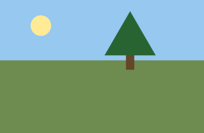
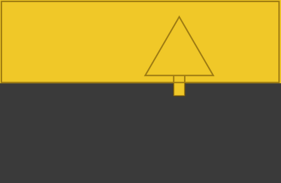
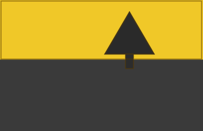
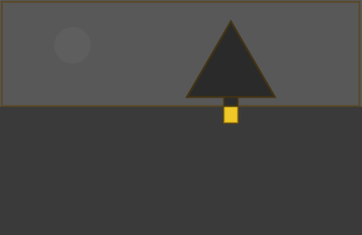
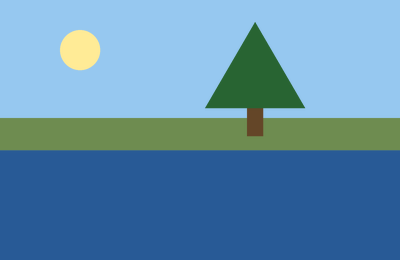
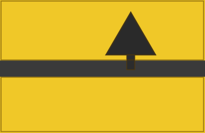
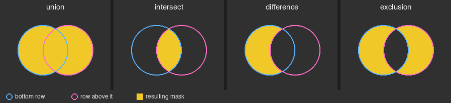
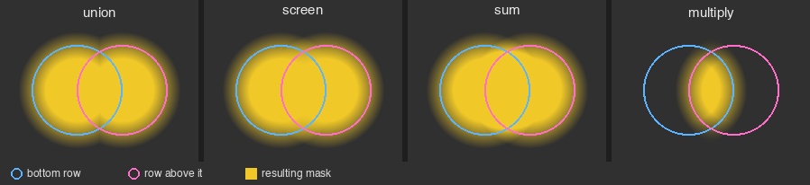
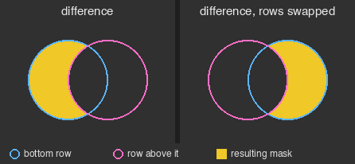

# Authoring flexi masks: a primer

## Let's start with an example

You have this photo:



You want to darken the sky with the exposure module. But a tree sticks up into the sky, and it should keep its exposure.

So you want to mask the *sky*, and then subtract the *tree* from it.

When you start a new flexi mask, it shows you a "whole mask" group. This group has an operator, which by default is **union**:

```text
1. group "whole mask" (union)
```

A group combines its elements from the bottom up (like the pixelpipe) using its operator.

For simplicity, let's assume that you already have two individual masks that cover the two elements. These could be raster masks from other modules, simple shapes, parametric channels or complex objects made of a combination of those. It does not really matter.

If you add your two elements (*sky*, then *tree*) to the *whole mask* group, you get something like this:

```text
1. group "whole mask" (union)
2. ├ tree
3. └ sky
```

This reads as:

> The whole mask (1) is the **union** of the *sky* (3) and the *tree* (2).

However, this would not produce the mask that you want. The **union** operator takes all the pixels from each element, so instead of excluding the *tree* from the mask you would be including it in the masked area.



What you want to do, instead, is to subtract (**difference**) the *tree* from the *sky*. So, change the *whole mask* operator to **difference**:

```text
1. group "whole mask" (difference)
2. ├ tree
3. └ sky
```

This reads as:

> The whole mask (1) is the **difference** of the *sky* (3) and the *tree* (2).

That is: the *sky*, minus the *tree*. This is exactly what you wanted:



Note that the order matters. A **difference** keeps its bottom row and subtracts everything above it. If you swap the two rows, you get the *tree* minus the *sky*, which is just the bit of trunk below the horizon:



### Adding the lake

Now the photo also has a lake, and you want to darken it too:



You could try adding the *lake* to the *whole mask* group:

```text
1. group "whole mask" (difference)
2. ├ tree
3. ├ lake
4. └ sky
```

This reads as:

> The whole mask (1) is the **difference** of the *sky* (4), the *lake* (3) and the *tree* (2).

This is not what you want: the **difference** subtracts everything above the *sky*, so the *lake* gets subtracted too, not added.


What you want to do is subtract only the *tree* from the **union** of the *sky* and the *lake*. Read it again:

> **subtract** only the *tree* from the **union** of the *sky* and the *lake*.

So, you need another group! You need to compute the **union** of the *sky* and *lake* before you can subtract the *tree* from it!

It looks like this:

```text
1. group "whole mask" (difference)
2. ├ tree
3. └ group "to dim" (union)
4.   ├ lake
5.   └ sky
```

And it reads as:

> The *whole mask* (1) is the **difference** between what you want *to dim* (3) and what you do not want to dim, i.e., the *tree* (2).
> In turn, what you want *to dim* is the **union** of the *sky* (5) and *lake* (4).

This produces exactly the result that you wanted:


### More than one way to do it

Often, different masks give the same result. Here, the *tree* does not overlap the *lake*, so there is nothing to subtract from the *lake*. You could just as well subtract the *tree* from the *sky* first, and then add the *lake*:

```text
1. group "whole mask" (union)
2. ├ lake
3. └ group "sky without tree" (difference)
4.   ├ tree
5.   └ sky
```

This reads as:

> The *whole mask* (1) is the **union** of the *sky without tree* (3) and the *lake* (2).
> In turn, the *sky without tree* is the **difference** of the *sky* (5) and the *tree* (4).

And it produces the same mask:



Pick whichever matches how you think about the photo. And keep in mind that, in this case, the two are only the same because the *tree* and the *lake* do not overlap. If a branch hung over the water, the second version would add it back with the *lake*, and only the first one would keep it out of the mask.

## Reading a mask

A group holds the rows that its operator applies to. The operator is applied from the bottom up (like the modules in the pixelpipe). You read each group as:

> the **[operator]** of *[bottom element]*, ..., *[top element]*

You read the whole mask from the outside in and from the bottom up, so in our example:

1. the *whole mask* is a **difference**: its bottom row (*to dim*) minus its top row (*tree*)
2. its bottom row, *to dim*, is the **union** of *sky* and *lake*
3. *tree* is the element that will be **subtracted** from *to dim*

Together: (*sky* plus *lake*), minus *tree*.

## How to come up with it

Work from the outside in, starting from the sentence that describes what
you want.

1. Find the last step. In "*sky* and *lake*, but not *tree*", the final
   step is "but not": a cut. So *whole mask* is a **difference**.
2. Find what is being cut. In a **difference**, that is the bottom row.
   Here it is "*sky* and *lake*". That is more than one thing, so it gets its
   own group: a **union** (to add them), named *to dim*.
3. Find what cuts: everything above the bottom row. Here, *tree*.
4. Repeat inside each new group, until every row is a single element.

Then build it in the panel:

1. set *whole mask*'s operator to **difference**
2. add a group with **union**, and rename it *to dim* (right-click the group
   → rename)
3. with *to dim* selected, draw *sky* and *lake*
4. click *to dim*'s title again to deselect it, then draw *tree*: with no
   group selected, new shapes go into *whole mask*
5. if a row ends up in the wrong place, drag it: *to dim* must be the
   bottom row of *whole mask*

### The one rule

Every group is a stack of rows with one operator. A row is an element or
another group. Read each group from the bottom row up. Everything below
is about picking the operator and putting the rows in the right order.

### The power of composition

Once you understand the gist, building more complex masks is just a matter of adding more elements. There is nothing new to understand.

For example, each element in our example could be made of several bits and pieces. The tree may be the **union** of two **parametric** channels (one `hz` channel to select the *leaves*, another one for the *trunk and branches*) and some **subtractive** brush strokes to *clean up* the selection. That's no problem: the *tree* element becomes a **difference** group. Within this group, you will put the **union** of the parametric channels at the bottom, because you want to subtract from that union, and the brush strokes above.

The result will be something like this:

```text
1.  group "whole mask" (difference)
2.  ├ group "tree" (difference)     <-- the tree became a group
3.  │ ├ group "clean up" (union)
4.  │ │ ├ brush stroke N
    │ │ ├ ...
5.  │ │ └ brush stroke 1
6.  │ └ group "trunk, branches and leaves" (union)
7.  │   ├ hz channel "leaves"
8.  │   └ hz channel "trunk and branches"
9.  └ group "to dim" (union)
10.   ├ lake
11.   └ sky
```

The *sky* and *lake* could themselves be a combination of parametric channels and shapes. It does not matter. The mask gets bigger, but the principle is always the same.

## The operators

Each picture shows what a group with two shapes produces. The blue circle is
the bottom row, the pink one the row above it; yellow is the mask.



| operator       | in plain words                                       | order matters? |
|----------------|------------------------------------------------------|----------------|
| **union**      | "add": everything any row covers                     | no             |
| **intersect**  | "keep only the overlap": where every row covers      | no             |
| **difference** | "cut out": the bottom row, minus every row above it  | **yes**        |
| **exclusion**  | "either, but not both": overlaps are cleared         | rarely*        |

\* only with three or more rows that have soft edges or partial opacity.

### Soft edges: sum, screen, multiply

Masks aren't just "in" or "out": feathered edges and opacity make them
partial. That's where the other three operators come in. They behave like the
ones above for solid shapes, but treat partial areas differently (outlines
here mark the halfway point of each feather):



| operator     | in plain words                                                    | like a softer... |
|--------------|-------------------------------------------------------------------|------------------|
| **union**    | the stronger row wins; overlapping feathers can leave a crease    |                  |
| **screen**   | overlapping feathers blend smoothly, with no crease               | **union**        |
| **sum**      | partial areas add up, so two half-strength rows give full strength | **union**        |
| **multiply** | strong only where every row is strong; fades quickly              | **intersect**    |

When in doubt, use **union** to add and **intersect** to restrict.

## Order matters for difference

A **difference** keeps the bottom row and cuts away everything above it. Swap
the rows and you cut the other way:



So, to subtract *A* from *B*: make a **difference** group with *B* at the
bottom and *A* above it. Say it as a sentence, reading upward: "*B*, minus
*A*".

If the result is the opposite of what you wanted, drag the rows to swap them.

## Groups inside groups

A group can be a row of another group, as *to dim* is in the example. Its
finished result then acts like a single shape, the same way brackets work
in arithmetic.

Not every mask needs nesting. "The bright parts, only inside this gradient"
is one **intersect** group holding a luminance channel and a drawn gradient,
in any order.

### The quick way: compose

Right-click a row and choose "compose", then an operator. The row goes into
a new group with that operator, as its bottom row, with an empty group above
it to draw into. To cut something out of a finished shape, compose it with
**difference** and draw into the empty group.

## Inverting

- "invert" on an element (right-click → invert): it selects what it used to
  leave out. "Everything except this circle".
- "invert output" on a group (right-click → invert output): flips the
  group's finished result.

These are not the same thing when a group has several rows. In a **union** group
of two circles, inverting each circle gives everything except the spot where
they overlap. Inverting the group's output gives everything except both
circles.

## Opacity

Opacity scales a row before it's combined. In a **difference** group, an
element at 50% opacity cuts only halfway through. A group's own opacity
scales its finished result.

## Cheat sheet

| I want...                                   | build                                                 |
|---------------------------------------------|-------------------------------------------------------|
| *A* and *B* together                        | **union**, any order                                  |
| only where *A* and *B* overlap              | **intersect**, any order                              |
| *B* without *A*                             | **difference**, *B* at the bottom, *A* above          |
| *A* or *B*, but not where they overlap      | **exclusion**                                         |
| everything except *A*                       | *A*, inverted                                         |
| *A* and *B*, without *C*                    | **difference**: a **union** group of *A* and *B* at the bottom, *C* above |
| soft brush strokes that merge without seams | **screen**                                            |
