# User documentation

## Panel overview

Flexi mask is a different way to build a module's mask: an ordered list of groups instead
of one flat shape list. 

The flexi mask panel is divided into four main areas:

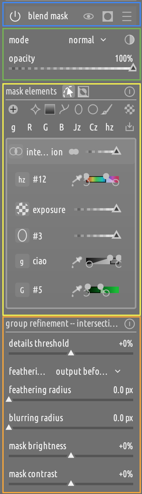

1. A **header** (blue).

2. The **blend mask** settings area (green), which is the same as in classic mask mode.

3. The **mask elements** area (yellow), which is where most of the user-facing changes are. This is where mask elements are added to groups and groups are built and composed.

4. The **mask refinement** area (orange), which is by and large identical to the corresponding area in classic mode. The only difference is that the heading of the refinements panel reflects the currently selected group or element:

    * If a group/element is selected, then the refinement applies only to that group/element. 
    * If no group/element is selected, then the refinement applies to the mask as a whole.

## Header

The header has four elements (plus a caption):

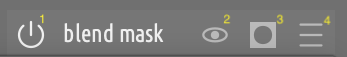

1. **On/off switch**: toggles the blend mask for the current module on/off.

2. **Visibility toggle**: temporary disables the effect of the mask.

3. **Display mask toggle**: shows an overlay on the image to visualize the mask, as opposed to its effect.

4. **Options menu**: gives access to group presets and allows to reposition the panel to better suite your editing workflow.

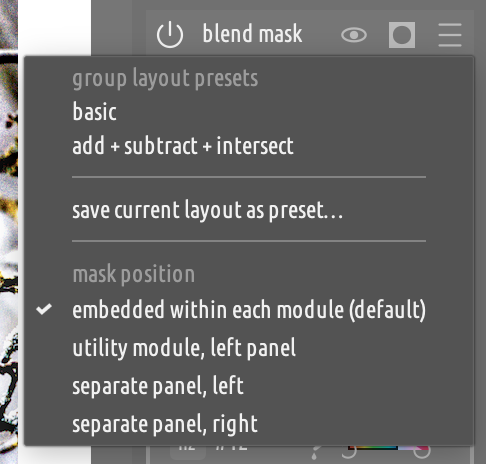

### Group presets

A group preset is just a configuration of groups with no mask elements and can be used to streamline common workflows. Two presets come out of the box:

* **basic** (default), a single group with union operator (as exemplified in the image)
* **add + subtract + intersect**, which implements a common way to build selective masks.

### Mask panel position

By default, the mask panel is embedded in each module. However, you can decide to move it:

* As a utility panel in the left panel.
* In a separate, dedicate vertical panel on the left or right. The panel will take all the height of the canvas.

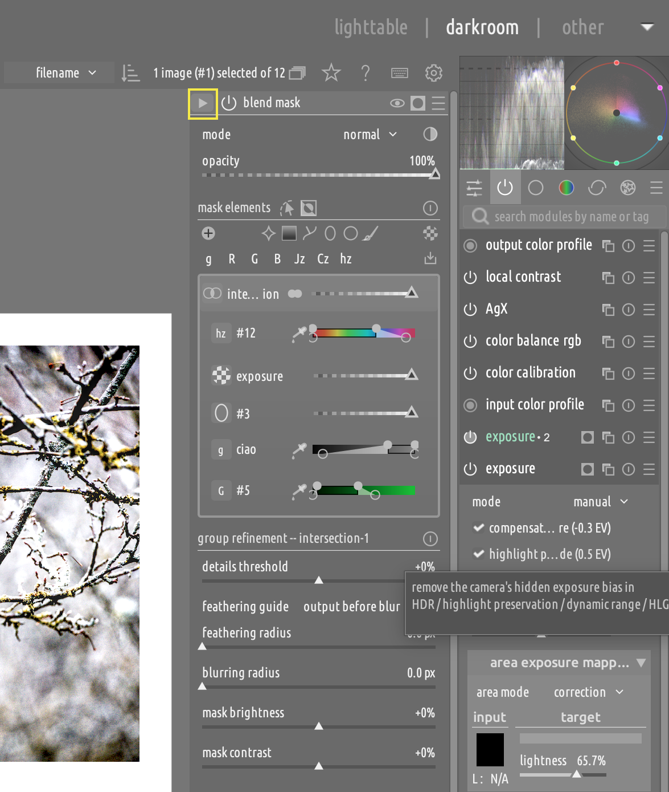

When hosted in a separate panel, the header gains a "collapse" button which can be use to turn the panel into a small overlay button in the corresponding corner of the canvas.
Clicking on this button will restore the panel.

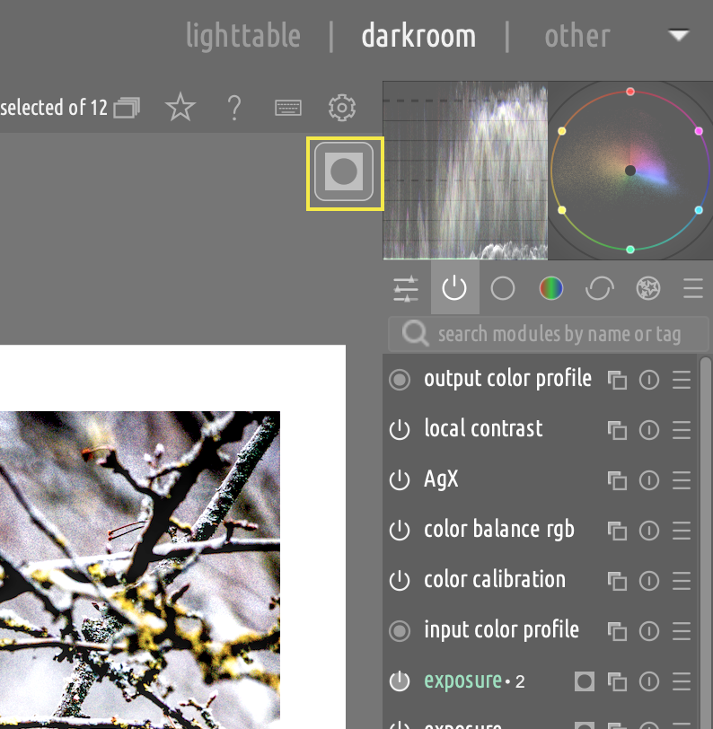

## Mask elements panel

Let's take a closer a look at the **mask elements** panel:

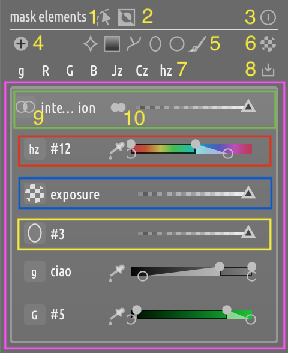

On the first row, there are three main controls:

1. The **edit mask elements** toggle, inherited from the classic mask panel, which shows the outline and control points of mask shapes on the canvas.
2. The **invert mask** button, which inverts all mask elements at once.
3. The **reset mask** button, which clears all mask elements and starts a new mask from scratch.

The next two rows allow you to **add elements to the mask**:

4. Add a new group.
5. Add a new shape.
6. Add a raster mask.
7. Add a new parametric channel. **NOTE**: You can hover the channel buttons and press `c` to toggle the channel overlay mask on and off.
8. Import a shape used in another module's mask.

Finally, there will be **one or more subpanels** (purple), one for each group added to the mask. Each group header has two controls:

9. The **between-groups** operator selector, which determines how the current group's mask is combined with the group below it. It sits at the far **left** of the group's row.
10. The **within-group** operator selector, which determines how the group's constituent mask elements are combined together. It sits immediately to the **left of the group's opacity slider**, at the far right of the row.

The group in this example has 5 elements, 3 of which are highlighted:

* A parametric channel element (red)
* A raster mask element (blue)
* A shape element (yellow)

The main widget on the parametric channel row is the range widget to select the channels' parameters.

On the raster and shape element rows, the main widget is the opacity slider for that element.

Note that the final opacity of any element is the product of its own opacity and the opacity of the group it belongs to.

Every row (group or element) also reserves a small, fixed-size column at its very right edge for **status badges**: a low-opacity warning (shown when a row's opacity is low enough that it barely contributes to the mask) and a solo/solo-edit indicator (see "Solo" and "Solo edit" below).

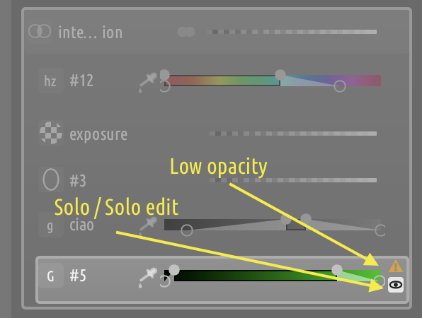

## Anatomy of a mask

A mask is an ordered sequence of groups, which are composed from the bottom up.

A group is an unordered set of mask elements. A mask element can be any of:

- A shape
- A raster mask
- A parametric channel

The final mask is computed from its building blocks in a bottom-up manner.

First, all elements in each group are combined using the group's **within-group** operator. The order within a group does not matter: all within-group operators are position invariant.

Then, all groups are combined using their respective **between-groups** operator, from the bottom up.

This is exemplified in the diagram below:

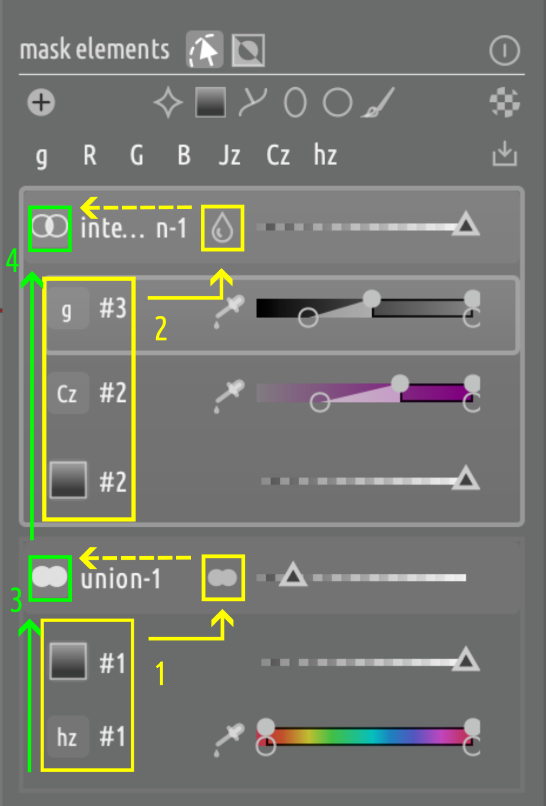

1. The elements of the bottom group (`union-1`) are combined with each other using the within-group operator `union` (yellow).

2. The elements of the top group (`intersection-1`) are combined with each other using the within-group `screen` operator (yellow).

3. The result of step (1) would normally be combined with the mask coming from below using the between-group operator (green). In this case, there is no mask below, since this is the first (base) group — its between-group operator is never evaluated, and it always contributes exactly its own mask, unchanged. See ["The base group"](#the-base-group) below.

4. The result of step (2) is combined with the mask coming from below (3) using the between-group operator `intersection` (green). The output of this operation is the final mask.

### Within-group operators

These decide how the elements *inside* one group combine into that group's own sub-mask. There are four, and — unlike a between-group operator — the order elements were added never changes the result:

* **Union** (default): a pixel counts if *any* element covers it. The usual choice for building up a region out of several shapes or channels.
* **Screen**: like union, but overlapping feathered edges blend smoothly into each other instead of showing a hard seam. Use it when soft-edged elements overlap and a visible line at the boundary would look wrong.
* **Intersect**: a pixel counts only where *every* element covers it — narrows the group down to the common area.
* **Multiply**: similar to intersect, but values fade proportionally instead of being clamped to the weakest element, at the cost of getting weaker the more elements are multiplied together. This is how classic's old multi-channel parametric mask combined its channels internally.

### Between-group operators

These decide how one group's *finished* sub-mask is folded into the mask built up by the groups below it. The choice is wider here, because a group is composing against everything accumulated so far, not just against its own members:

* **Union**, **Intersection**: same idea as their within-group counterparts above, but applied between the group and the running result — union adds coverage, intersection narrows it to the overlap.
* **Difference**: removes the group's sub-mask from the running result — this is how you subtract a group.
* **Sum**: adds the group's sub-mask like union, but the values actually add together instead of just keeping the stronger one, so overlapping regions can boost each other's coverage. Useful for gradually building up opacity across several groups.
* **Exclusion**: keeps what *differs* between the group and the running result — where both are already strong, they cancel each other out; where only one is strong, it stays. This is the same "exclusion" blend mode found in image editors, not a complement/invert — on its own (as the bottom group) it just passes the group's own mask through unchanged. A softer way to trim overlap than an outright difference.
* **Multiply**: multiplies the group's sub-mask into the running result, so anywhere this group is fully transparent stays fully transparent, and everywhere else gets scaled down by how much this group covers it.
* **Screen**: the same soft blending as within-group screen, applied between the group and the running result instead of between elements — smooths the seam where this group meets the one below it.

### The base group

The base (bottom-most) group has nothing below it to combine with, so its between-group operator is never evaluated — whichever one is shown on it, **the base group always contributes exactly its own mask**, unchanged. Pick any operator for it; it makes no visible difference on its own.

**If you want the base group's contribution to be a complement** instead — "start from everything, cut a hole where this shape is" — use **invert**, on the group's output or on an individual element, rather than the operator. For example: a base group with two circles and "invert output" set produces a full mask with two holes where the circles are

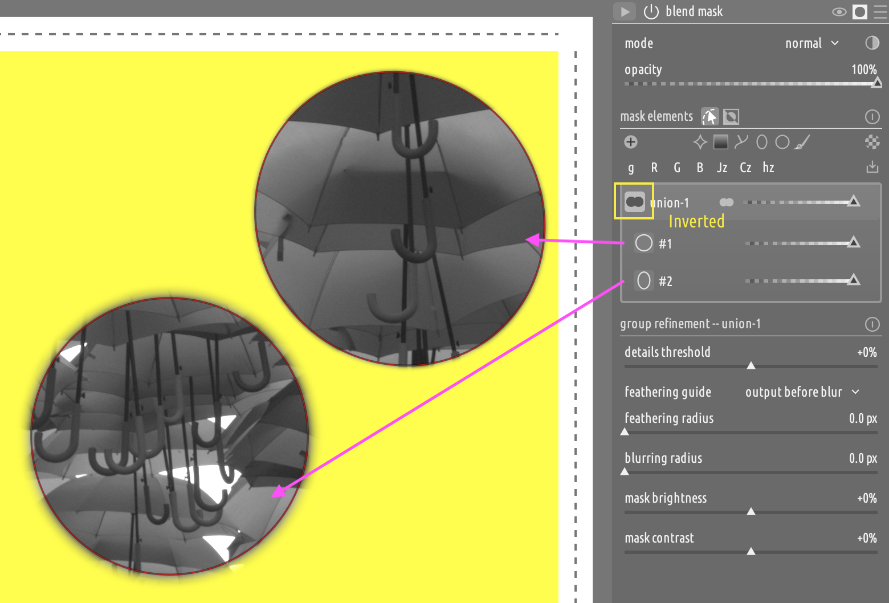

Without "invert output", the result would be just the circles, opaque inside and empty outside, regardless of which operator is selected.

### Creating a group

Click on the "add group" icon. The list of group operators will pop up, allowing you to select the operator to combine the new group with the ones below it.

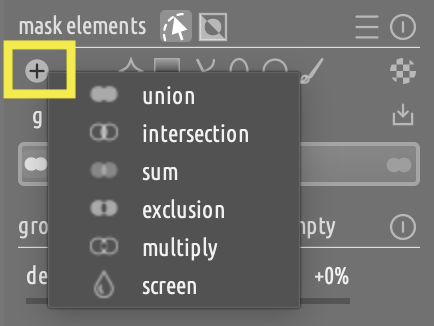

* **Click** on an operator to add the new group  **above** the currently selected group (or at the top of the group list, if no group is currently selected.)
* **Ctrl+Click** on an operator to add the new group **below** the currently selected group (or at the bottom of the group list, if no group is currently selected).

### Changing a group's between groups operator

Right click on a group's header to access the group options and actions menu, where you can select the operator used to compose a group's mask with the mask below.

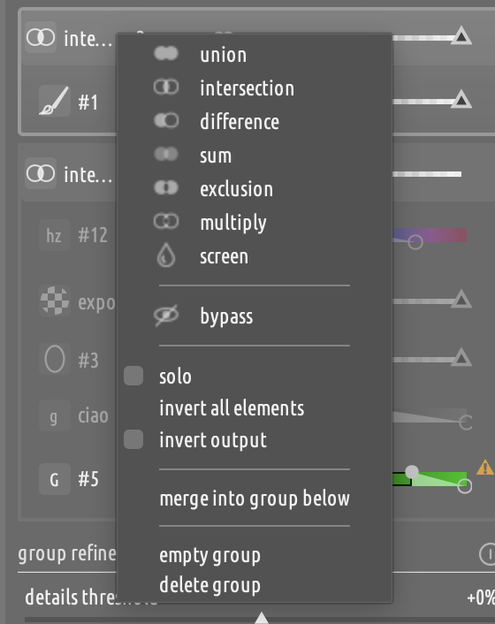

### Other group operations

The same menu also offers:
* **Bypass**, to temporarily ignore a group when composing the mask.
* **solo**, to solo the current group.
* **invert all elements**, which inverts the polarity of all the group elements.
* **invert output**, which inverts the output of the current group.
* **merge into group below**, which fuses the group into the one below it (adopting its operator).
* **empty group**, which removes all the elements from the current group (without deleting the group itself).
* **delete group**, which removes the group and all its elements.

### Changing a group's within group operator

Click on a group's within-group operator icon (the icon between the group title and the opacity slider) to change the operator used to compose the elements of the group.

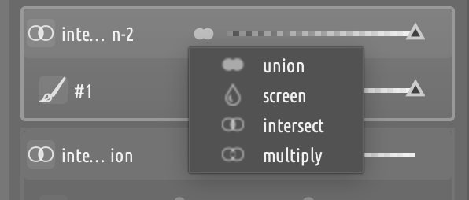

NOTE: the button is disabled if the group is empty.

### Moving a group

Drag a group and move it above/below any other group. Any group can end up at the bottom, with any operator — see ["The base group"](#the-base-group).

## Adding elements

To add an element to a group, first select the group that you want to add to, then select the element that you want to add. The add elements buttons will be disabled if no group is selected.

An element can be:

* A new shape
* A single parametric channel
* A raster mask
* A shape imported from another module

All elements within a group are combined using the same operator, and the order in which they are added to a group is irrelevant. There is no difference between a shape and a parametric channel or a raster mask - they are all just *elements*.

**NOTE:** Once a group is selected it will stay selected, so adding multiple elements to the mask will result in all the shapes being added to the same group. For example, you can create a `union` group and add multiple brush strokes to it, then clean up the selection by adding a `difference` group above it with one or more refining brush strokes.

### Parametric channels fine control

To achieve finer control on the range selectors of parametric channels, a fine-tuning widget can be summoned by right clicking as soon as any control point is selected.

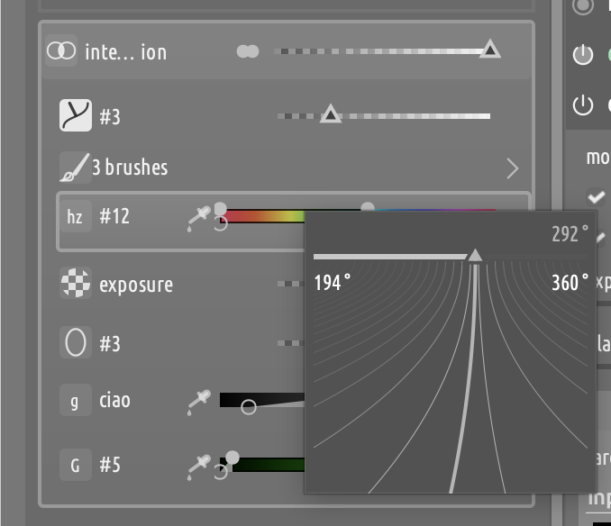

### Shape clustering

When a group has 3 or more shapes of the same type, they will be automatically clustered to remove clutter. 

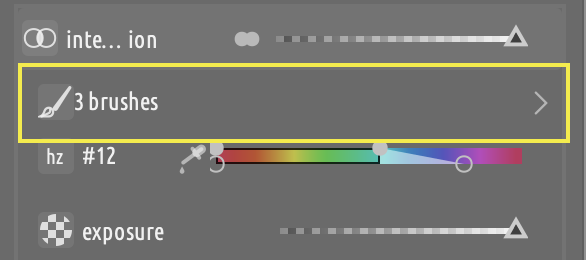

When clusters are created they are automatically collapsed, but they can be expanded clicking on the chevron icon, which will show all the invidual shapes.

A cluster has no effect on how a group is rendered, it is purely a UI convenience to reduce clutter. Note that clustering is done per-group, so you can have one cluster in one group and no clusters in another group.

## Element controls

**Right click** an element's header row to open its actions menu, then choose **delete**. The actions menu also gathers this row's other actions in one place: toggle properties, invert, solo, solo-edit (drawn shapes only), rename.

## Reordering and merging

You can drag elements from one group to another one to reorder them. Note that elements do not carry an operator with them - the operator is associated with the group.

## Solo

You can **solo** a group or element to hide all other mask elements and edit it in isolation. This is especially useful with the mask overlay turned on, so that you can isolate its effect and modify its parameters without interference from other mask elements.

To solo a group or element, **right-click** its row (or its lead icon) to open its **actions menu**, then check **solo**.

When an element or group is soloed, a small inverted-eye badge appears at the right edge of its row, in the same fixed slot used for the low-opacity warning:

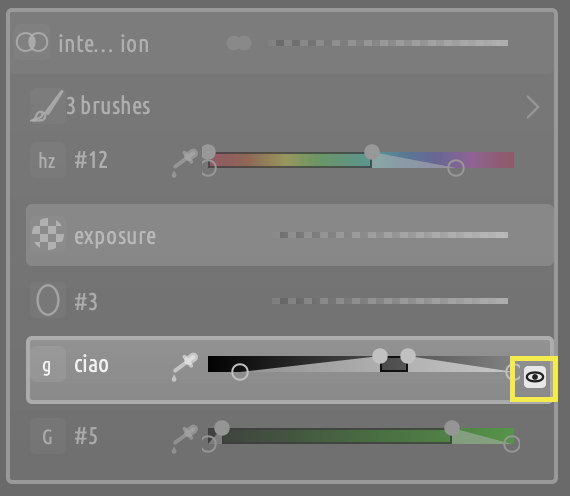

To turn solo off again, either **click the solo badge** itself, or uncheck **solo** from the same actions menu.

NOTE: Solo is exclusive: soloing a different group/element replaces the current solo target. While something is soloed, every other group/element is dimmed **and** its own controls (opacity slider, within-group selector, ...) become non-interactive, since they contribute nothing to the mask while suppressed.

## Solo edit

When a mask has many drawn elements it can be tricky to select individual nodes or shapes. The **solo edit** function is used to isolate one shape in the canvas, so that only that shape is editable. However, all the other shapes and mask elements are still active and contribute to the visible mask, so you can still see their combined effect.

Solo edit is toggled from the same **right-click actions menu** as solo, above (only offered for drawn shapes, which are the only elements with nodes/handles to edit).

NOTE: **Solo Edit** is different from **Solo**, and the two are mutually exclusive - turning one on turns the other off. Soloing an element means that only that element is visible, as if it were the only element in the mask, while Solo Editing means that only that element is editable, while the contributions of all the other elements is still visible.

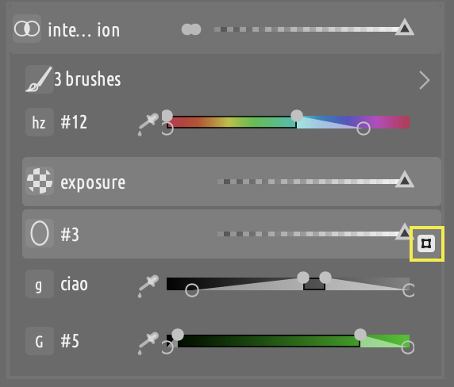

To exit solo edit, use the menu entry again or click on the badge.

## Expanded controls for shapes and parametric channels

Shape and parametric channel elements have additional controls that can be accessed via the row's right-click menu, or by `SHIFT+click` on the row's
header (lead icon or name).

For parametric channels, the expanded controls include:

1. The output channel of the parametric mask
2. The opacity slider.
3. The boost factor (for relevant channel types).

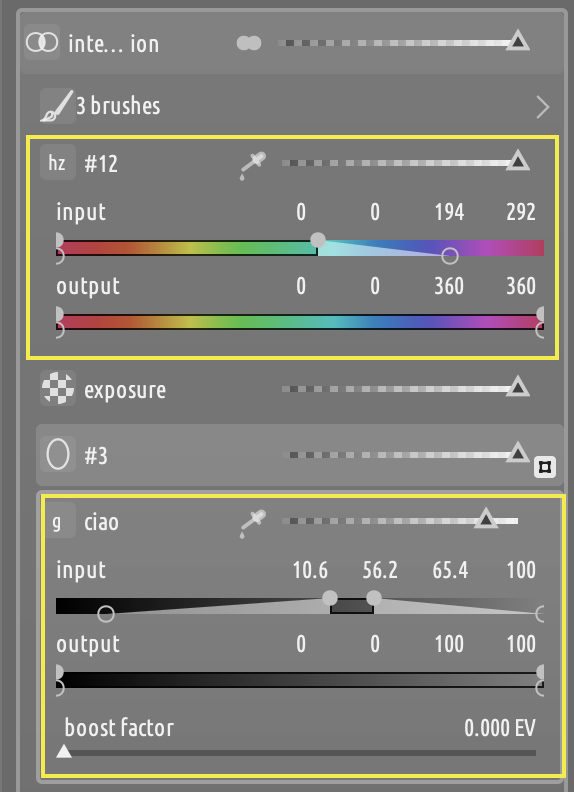

For shapes, the expanded controls include:

1. The feather slider.
2. The size slider.
3. (For paths) The grow/shrink slider.
4. The rotation slider.

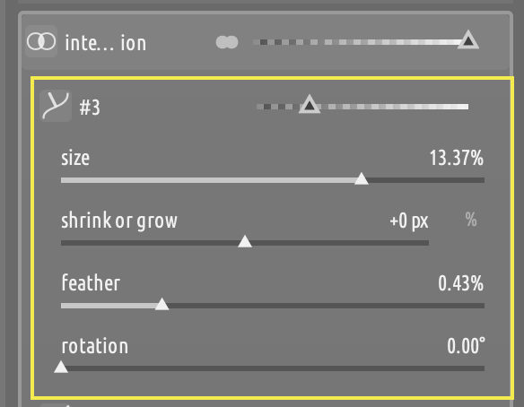

### Color picker

Each parametric channel row has a single, consolidated color-picker button (instead of two separate ones) that covers all four picking gestures:

* **Click**: set the range from the picked area of the **input** image.
* **Shift + Click**: set the range from the picked area of the **output** image.
* **Ctrl + Click**: pick a GUI color from the image (**point**).
* **Ctrl + Right-click**: pick a GUI color from the image (**area**).

The picker button sits at the left end of the row's own slider - the compact input slider when collapsed, or the opacity slider once the row is expanded - immediately to its left, the same way a group's within-group selector sits immediately to the left of its own opacity slider.

## Inverting groups and elements

You can invert a single element by selecting the "invert" option from the elements right-click menu.

When an element is inverted, its icon will be rendered accordingly.

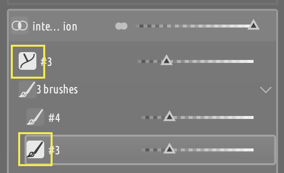

For groups, the actions menu offers two invert options:

* **Invert all elements**: a one-shot action that flips every element's own inverted state at once (the same thing `CTRL + click` does to a single element, applied to the whole group in one go). So, if there is one inverted element in a group, this will invert all the other elements and un-invert the previously inverted one. This does **not** persist as a group-level state - it only changes each element's own state, and the group icon does not reflect it.

* **Invert output**: a persistent, group-level toggle that inverts the group's own *combined* mask (after its elements have folded together) before it is composed with the groups below it. Unlike "invert all elements", this does **not** touch any individual element's own state - only the group's icon changes to reflect it.

**NOTE:** These two are mathematically different operations for any group with more than one element (inverting each input before combining them is not the same as inverting the combined result), so pick whichever matches what you actually want: flip each shape/channel independently, or flip the group's finished contribution as a whole.

## Refinement

Flexi has three levels of mask refinements:

* **Element level**: applies to the selected mask element (i.e., a single shape, raster mask or parametric channel)
* **Group level**: applies to the mask resulting from the combination of all the elements in the same group.
* **Whole-mask level**: applies to the mask resulting from the combination of all groups.

The controls are the same as in the classic mask panel, so nothing new here.
